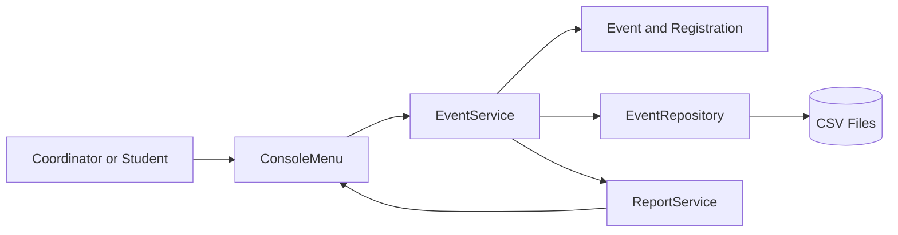
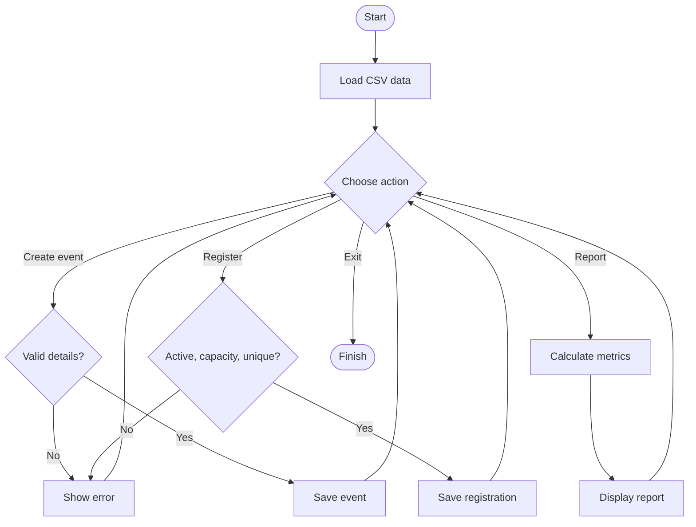
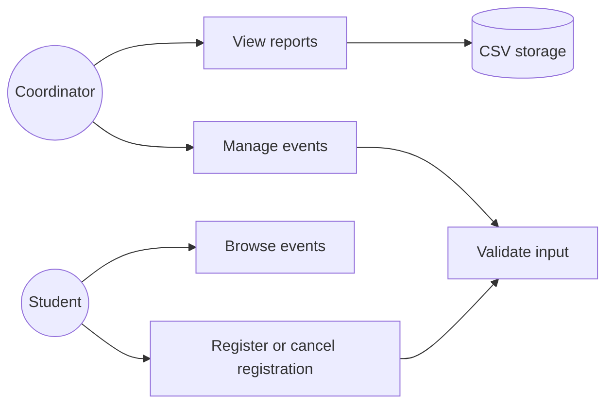
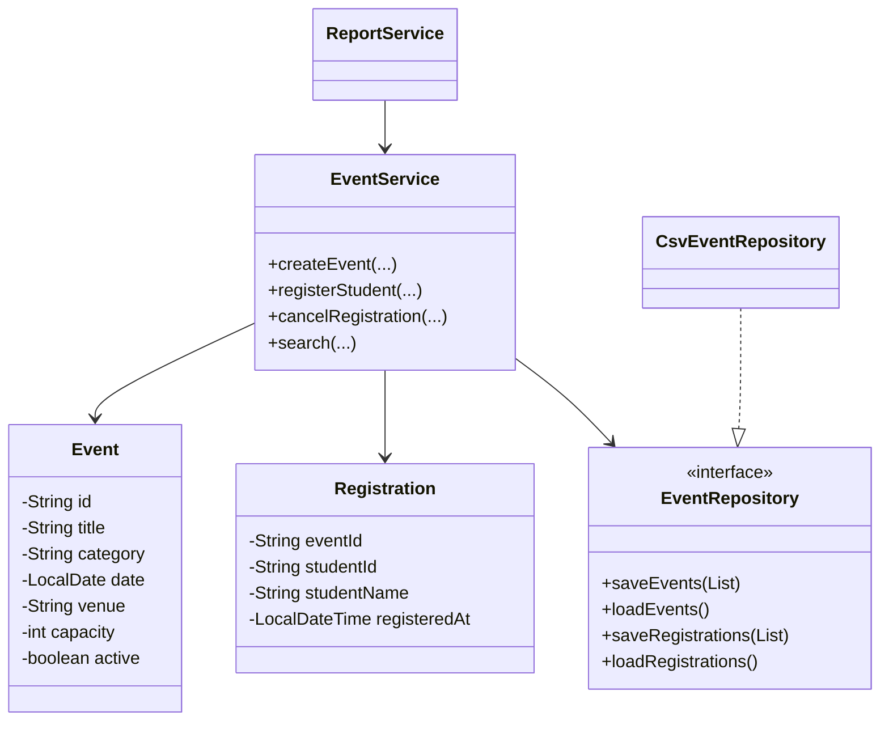
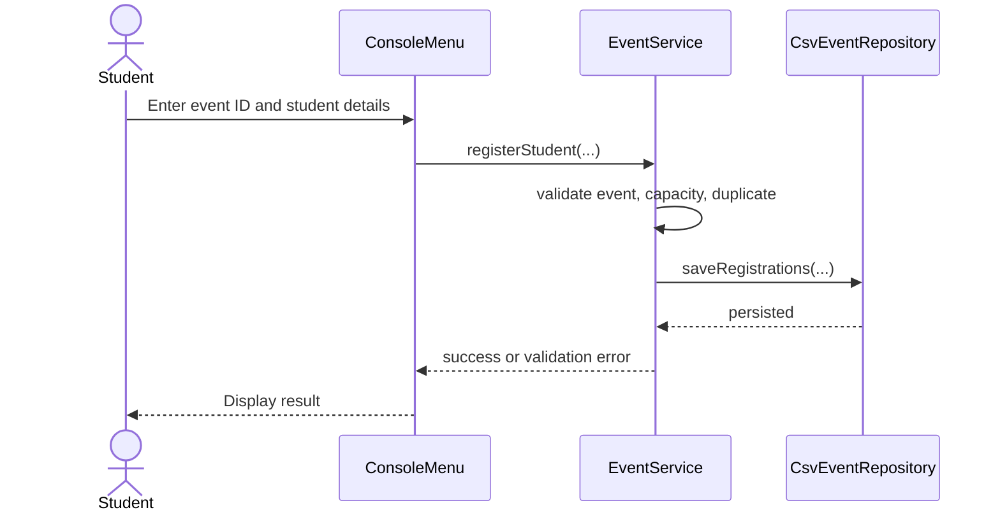

# CampusPulse Design Artefacts

## System Architecture

The presentation layer collects input, the service layer owns business rules, domain models hold state, and the repository layer handles persistence. Reports read validated service data and never write storage directly.

## Process Workflow

## Use Case Diagram

## Class Diagram

## Registration Sequence

## Storage Design

`data/events.csv`

| Column | Type | Description |
| --- | --- | --- |
| id | String | Unique event identifier |
| title | String | Event title |
| category | String | Academic, sports, cultural, or other |
| date | ISO date | Event date |
| venue | String | Location |
| capacity | Integer | Maximum registrations |
| active | Boolean | Whether registrations are open |

`data/registrations.csv`

| Column | Type | Description |
| --- | --- | --- |
| eventId | String | Related event ID |
| studentId | String | Unique student identifier |
| studentName | String | Display name |
| registeredAt | ISO datetime | Registration timestamp |

## Design Decisions

- A repository interface keeps storage replaceable and makes the service testable.
- `LocalDate` and `LocalDateTime` avoid ambiguous date strings.
- IDs are generated by the service, keeping identity rules outside the UI.
- CSV was selected because it is transparent for an academic demonstration and needs no external database setup.
- The service rejects invalid state before persistence, preserving data reliability.

## Testing Approach

`CampusPulseTest` is a dependency-free test runner using assertions. It uses a temporary directory and covers normal flow, duplicate prevention, capacity boundaries, cancellation, and report totals.

## Challenges and Learnings

The main challenge is keeping business rules consistent across menu actions and storage. The implementation demonstrates why validation belongs in the service layer, why persistence should be abstracted, and how collections support efficient reporting.

## Future Enhancements

- Add a graphical or web interface
- Replace CSV with SQLite or PostgreSQL
- Add role-based authentication
- Add email reminders and calendar export
- Add attendance check-in and richer dashboards

## References

- Oracle Java Documentation: https://docs.oracle.com/en/java/
- Java Platform, Standard Edition API Specification: https://docs.oracle.com/en/java/javase/
- Mermaid Diagram Syntax: https://mermaid.js.org/
